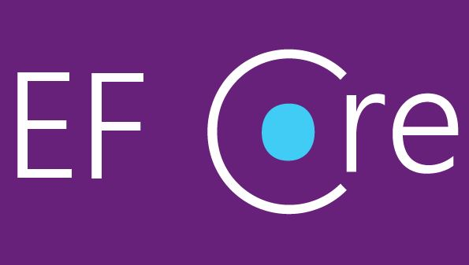
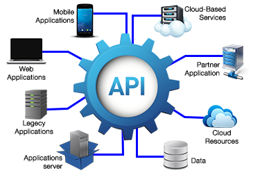

# CursoNETCore3.1
### 🚀💻 Tecnologias e Ferramentas utilizadas neste projeto
#

    
  
  

    
    
  
  

  

    

  
  
  

  

# Detalhes do projeto
NETCore 3.1 - C#+Arquitetura DDD+Entity Framework Core com MySQL+Swagger+AutoMapper+JWT Token

